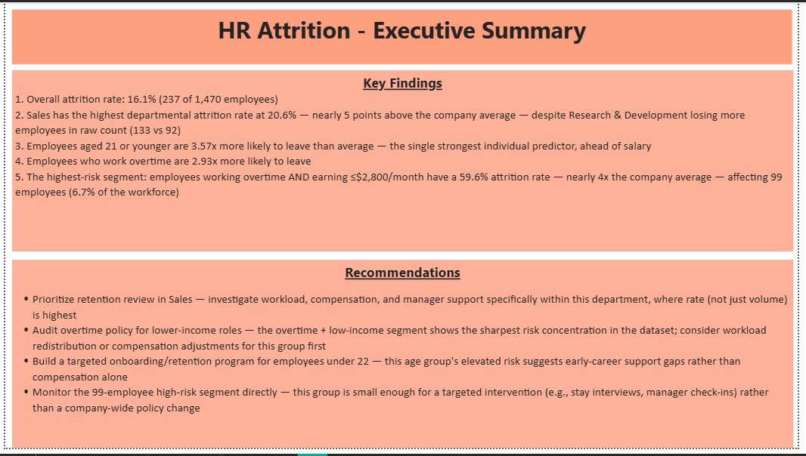
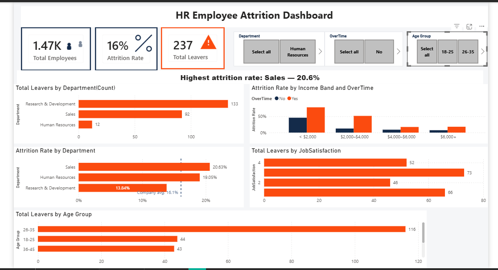
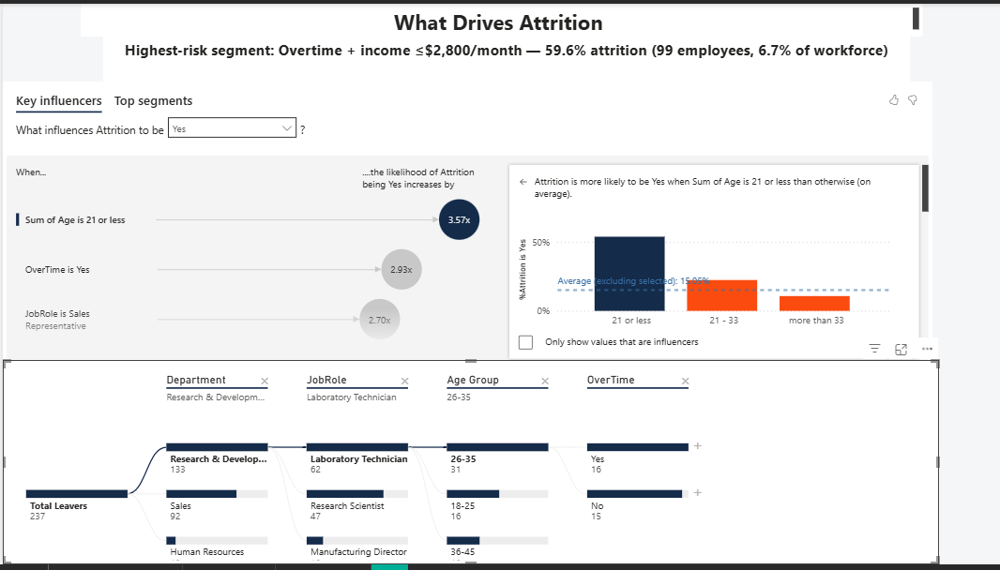

# HR Employee Attrition Dashboard

An interactive 3-page Power BI dashboard that diagnoses employee attrition — where it's happening, what's statistically driving it, and which specific group of employees represents the highest-leverage retention target.

**[Watch a 90-second walkthrough (Loom)](https://www.loom.com/share/87c430a634d048d1a5d1b51018d5ee1c)**



---

## Table of Contents

- [Business Problem](#business-problem)
- [Data](#data)
- [Data Preparation](#data-preparation)
- [Data Modeling & DAX](#data-modeling--dax)
- [Dashboard Walkthrough](#dashboard-walkthrough)
- [Key Findings](#key-findings)
- [Recommendations](#recommendations)
- [Tools](#tools)
- [What I'd Add Next](#what-id-add-next)

---

## Business Problem

A company is losing 16.1% of its workforce annually. Before spending on a retention program, leadership needs three questions answered with evidence, not guesswork:

1. **Where** is attrition actually concentrated — by department, measured as a rate, not just a headcount?
2. **Why** are people leaving — which factors are statistically associated with departure, not just correlated by eye?
3. **Who**, specifically, is highest-risk — and is that group large enough to be a real pattern worth acting on, or too small to matter?

This project treats those three questions as three stages of analysis, rather than one dashboard trying to answer everything at once — which is why the report is split into three purpose-built pages.

## Data

- **Source:** IBM HR Analytics Employee Attrition dataset — 1,470 employee records, 35 attributes, a publicly available standard HR analytics practice dataset.
- **Fields used in this analysis:** Department, JobRole, Age, MonthlyIncome, OverTime, JobSatisfaction, YearsAtCompany, WorkLifeBalance, DistanceFromHome, NumCompaniesWorked, StockOptionLevel, Attrition.
- **Known limitation, stated upfront:** this dataset is a single point-in-time snapshot — there are no hire dates, exit dates, or repeated observations over time. That means trend analysis ("is attrition rising or falling?") isn't something this data can honestly answer, so it's deliberately left out rather than simulated.

## Data Preparation

- Confirmed no missing values or duplicate employee records across all 1,470 rows.
- Created an **Age Group** column (18–25, 26–35, 36–45, 46–55, 56+) to support demographic breakdowns.
- Created an **Income Band** calculated column, bucketing `MonthlyIncome` into four brackets (< $2,000, $2,000–$4,000, $4,000–$6,000, $6,000+), so compensation could be analyzed as a category rather than only as an average.

```dax
Income Band =
SWITCH(
    TRUE(),
    HRData[MonthlyIncome] < 2000, "< $2,000",
    HRData[MonthlyIncome] < 4000, "$2,000–$4,000",
    HRData[MonthlyIncome] < 6000, "$4,000–$6,000",
    "$6,000+"
)
```

## Data Modeling & DAX

Three core measures drive every rate calculation in the report:

```dax
Total Leavers =
CALCULATE(COUNTROWS(HRData), HRData[Attrition] = "Yes")

Attrition Rate =
DIVIDE(
    CALCULATE(COUNTROWS(HRData), HRData[Attrition] = "Yes"),
    COUNTROWS(HRData)
)

Attrition Rate by Dept =
DIVIDE(
    CALCULATE(COUNTROWS(HRData), HRData[Attrition] = "Yes"),
    COUNTROWS(HRData)
)
```

`Attrition Rate` and `Attrition Rate by Dept` use identical logic on purpose. DAX measures recalculate automatically within whatever filter context they're placed in — department, income band, age group, or any slicer selection — so the same formula correctly produces the company-wide rate on a KPI card *and* the per-department rate on a bar chart, without writing separate logic for each. This is also why a single benchmark reference line (set to the flat value `0.161`, the company-wide rate) can be laid across a per-department chart and remain a meaningful comparison point — it represents a fixed target, not a context-dependent one.

## Dashboard Walkthrough

### Page 1 — Executive Summary


The landing page. No charts — just the finding and the recommendation, stated in plain language, so a stakeholder gets the full picture in under 30 seconds without needing to read a single visual. Everything on this page is a direct restatement of what the other two pages prove.

### Page 2 — Dashboard


The operational view, built around one central design decision: **rate is shown next to count, never as a replacement for it.**

- **KPI row:** Total Employees (1,470), Attrition Rate (16.1%), Total Leavers (237)
- **Slicers:** Department, OverTime, Age Group — cross-filter every chart on the page simultaneously
- **Total Leavers by Department (count):** Research & Development loses the most people in raw numbers (133)
- **Attrition Rate by Department**, with a dashed benchmark line at the company average (16.1%): this is the chart that overturns the raw-count story — **Sales has the highest rate at 20.6%**, despite losing fewer people than R&D in absolute terms. R&D's rate (13.8%) is actually the *lowest* of the three departments.
- **Attrition Rate by Income Band × OverTime:** attrition rate climbs sharply for the lowest income band, and is consistently higher for employees working overtime at every income level — the gap between the "OverTime: Yes" and "OverTime: No" bars narrows as income rises, visually showing the two factors compounding.
- **Total Leavers by Job Satisfaction** and **Total Leavers by Age Group:** supporting demographic context.

### Page 3 — Key Drivers


The diagnostic view, built on two of Power BI's AI-assisted analytics visuals rather than manually chosen charts — this page answers "why," using statistical ranking instead of eyeballing bar heights.

- **Key Influencers:** analyzes `Attrition = Yes` against eleven candidate factors (OverTime, MonthlyIncome, YearsAtCompany, JobSatisfaction, WorkLifeBalance, DistanceFromHome, NumCompaniesWorked, StockOptionLevel, Department, JobRole, Age) and ranks them by actual statistical influence, not visual impression.
- **Top Segments** (a second mode of the same visual): automatically searches for the single combination of factors with the highest attrition rate, and reports the sample size behind it — critical, since a dramatic-looking percentage from a handful of people isn't a pattern.
- **Decomposition Tree:** an interactive drill path — Total Leavers → Department → Job Role → Age Group → OverTime — that lets a viewer trace exactly how a top-line number (237) breaks down at each level, on demand, rather than being told the breakdown up front.

---

## Key Findings

All figures below are pulled directly from the dataset and verified against the dashboard.

1. **Overall attrition rate: 16.1%** (237 of 1,470 employees)
2. **Rate and volume tell two different stories.** Research & Development loses the most employees in raw count (133 of 961, a 13.8% rate), but **Sales has the highest attrition *rate* at 20.6%** (92 of 446) — nearly 5 points above the company average. A dashboard that only showed raw counts would have pointed leadership at the wrong department entirely.
3. **Age is the single strongest individual predictor of attrition** — employees aged 21 or younger are **3.57x** more likely to leave than average (their actual attrition rate is 53.7%, more than 3x the company baseline), ahead of salary, tenure, or job satisfaction as a predictor.
4. **Overtime is the second-strongest driver** — employees working overtime are **2.93x** more likely to leave (their actual rate is 30.5%, nearly double the company average).
5. **Risk concentrates further within Sales specifically at the Sales Representative role** — 2.70x more likely to leave, meaning the department's elevated rate isn't spread evenly across every role within it.
6. **The single highest-risk, statistically validated segment:** employees who work overtime **and** earn ≤$2,800/month have a **59.6% attrition rate** — nearly 4x the company average — across **99 employees (6.7% of the workforce)**. That sample size matters: large enough to be a genuine pattern rather than noise, small enough to be a realistic, targeted intervention rather than a company-wide policy overhaul.

## Recommendations

1. **Prioritize a retention review in Sales specifically**, not R&D. Rate — not headcount lost — is the right signal here, and it points at workload, compensation structure, and manager support within this one department.
2. **Audit overtime policy for lower-income roles first.** The overtime + low-income segment shows the sharpest risk concentration in the entire dataset. Workload redistribution or targeted compensation adjustment for this specific group is likely to have more impact than a broad policy change.
3. **Build a targeted onboarding and early-tenure support track for employees under 22.** This age group's elevated risk points toward an early-career support gap — likely addressable through mentorship or career-pathing — rather than a compensation problem alone.
4. **Directly monitor the 99-employee high-risk segment.** It's small enough for hands-on intervention — stay interviews, manager check-ins, a structured retention conversation — rather than a company-wide initiative that dilutes both cost and impact.

## Tools

Power BI Desktop · DAX (measures & calculated columns) · Power BI Key Influencers & Decomposition Tree (AI-assisted analytics visuals) · Data modeling

## What I'd Add Next

- A public, no-download link (Publish to Web requires a work/school Microsoft account, which isn't available to me currently — the Loom walkthrough above is the interim solution)
- An external industry-benchmark attrition rate, if a reliable public source can be sourced, to contextualize the 16.1% company figure against the broader market
- A second dataset that includes real hire and exit dates, to add genuine trend-over-time analysis — deliberately not simulated in this version, since the current data doesn't support it
